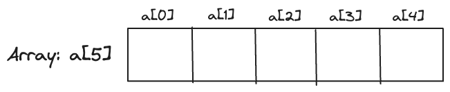
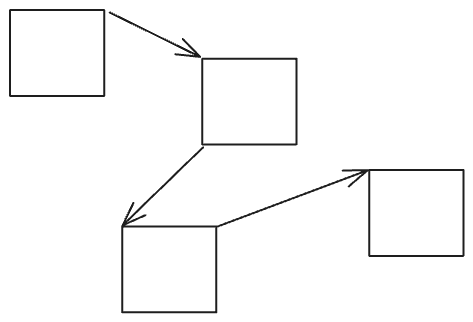

# 1. Array vs Linked List


## 우선, Array와 List란?
### 공통점
1. **같은 Type**의 요소(Element)들을 저장하는 **선형** 자료구조(Linear Collection)
2. 중복 요소가 존재할 수 있다.

표면적으로는 같아 보이나, 이 둘의 차이점이 중요한 지점이다.

### Array(배열)
대표적인 특징으로 다음을 꼽을 수 있다.

1. 메모리 상에 데이터가 연속적으로 저장된다.
   

   -> 논리적 저장 위치 = 물리적 저장 위치
   -> a[3] 의 주소 = a[0]의 주소 +  3 * (Data Type의 크기)

2. 고정된 크기(= 선언 시에 할당한 크기)를 가진다.
   -> 배열을 선언될 때 해당 배열이 가지는 크기만큼 메모리에 할당된다.
   -> 배열의 크기가 5라면, (Data Type의 크기 * 5) 만큼 메모리에 할당된다. (ex. int[5] 의 크기 = 20 Byte, int의 크기 * 5 = 4 Byte(아키텍쳐와 언어에 따라 차이가 있지만 여기서는 4바이트를 전제) * 5 = 20 Byte )
   -> 데이터가 1개만 채워져있어도 메모리에 미리 5만큼 할당되어있기 때문에 배열의 크기는 5이다.

위와 같은 특징에 의해 다음과 같은 특징을 가진다.
1. 높은 Cache Hit Rate
    - why? 메모리상 데이터의 연속성 = 공간 지역성(Spacial Locality)이 높기 때문
2. 사용시 메모리 오버헤드가 거의 발생하지 않는다
    - 선언시 데이터 크기를 정해놓기 때문. 할당된 메모리 이외의 사용은 거의 없음
3. 삽입과 삭제에 O(N) 시간 복잡도 발생
4. Index를 통한 원소 접근에 O(1) 시간 복잡도 발생


### List(리스트) (LinkedList와 ArrayList)
자료 구조의 관점과 프로그래밍 언어의 관점에서 바라보는 List는 그 의미가 조금 다르다.
여기서 설명하는 List는 프로그래밍 언어의 관점에서 Linked List(연결 리스트), ArrayList 등의 선형 자료 구조를 구현할 때 사용되는 추상 자료형이다.

아래에서는 LinkedList 구현체를 기반으로 설명을 진행한다.

#### LinkedList

특징은 다음과 같다.
1. 메모리 상에 데이터가 연속적으로 저장되지 않는다.
   

   -> 논리적 저장 위치 != 물리적 저장 위치
2. 크기가 고정되어 있지 않다
   -> 메모리상 할당된 주소를 넘어, 랜덤한 주소의 위치에 새로운 데이터를 저장할 수 있다.

위와 같은 특징에 의해 다음과 같은 특징을 가진다.
1. 낮은 Cache Hit Rate
    - why? 랜덤한 메모리 주소에 위치한 데이터의 특성 상, 공간 지역성이 낮기 때문
2. 메모리 오버헤드가 존재한다.
    - 저장된 데이터 접근을 위한 List의 크기, 각 노드 다음 index에 위치한 데이터 노드의 주소값 등 부가 정보를 저장하고 있기 때문이다.
3. 유동적인 크기(개수)의 데이터를 저장할 때에 효율적이다.
    - Array(배열)은 미리 정해놓은 크기 내에서만 데이터를 저장할 수 있다. 따라서, 배정 크기보다 크거나, 작은 수의 데이터를 저장해야할 때 공간의 비효율이 발생한다.
4. 원소에 접근할 때 O(N)의 시간 복잡도를 갖는다.
    - Head 노드부터 순차적으로 조회하여 특정 Index의 노드의 주소를 하나씩 탐색해서 찾아가야 되기 때문이다.
5. 삽입과 삭제의 경우 O(N)의 시간 복잡도를 갖는다.

위와 같은 특징을 가진 LinkedList의 Java에서의 구현 코드는 다음과 같다.
```java
public class LinkedList<E>  
    extends AbstractSequentialList<E>  
    implements List<E>, Deque<E>, Cloneable, java.io.Serializable  
{  
    transient int size = 0;   
    transient Node<E> first;  // Head, 즉 List의 0번째 노드의 주소
    transient Node<E> last; // Tail, 즉 List의 N-1번째(마지막) 노드의 주소

	private static class Node<E> {  
	    E item;  // i 번째 index에 존재하는 데이터
	    Node<E> next; // i + 1 번째 Node의 주소
	    Node<E> prev;  // i - 1 번째 Node의 주소
	  // ...
	}
}
```


#### ArrayList
ArrayList는 List의 구현체로, 이름 그대로 Array의 특성과 List의 특성 모두를 가지고 있다.

ArrayList 내부에서 Array로 데이터를 저장해 공간 지역성이 높지만, List처럼 List의 size를 따로 저장하여 Head와 Tail Node의 위치가 어디인지 저장하고 있다.

다만, ArrayList 내부에서 데이터를 저장하고 있는 Array의 크기는 불변이기 때문에, 데이터를 삽입, 삭제할 때에 기존 Array를 복제하면서 데이터 변경을 진행하기 때문에 이에 따른 오버헤드가 존재한다.
또한, 선언시에 크기를 함께 선언해야하는 Array의 특성상, 디폴트로 선언되는 Array의 사이즈가 정해져있으며 데이터 삽입시 크기를 늘려가며 사용한다.
