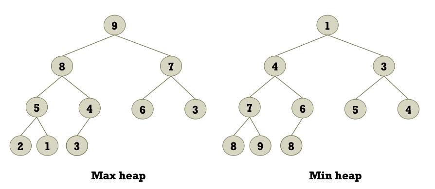
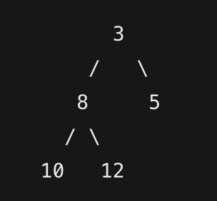
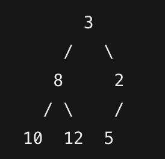
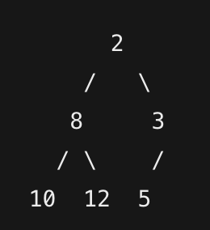
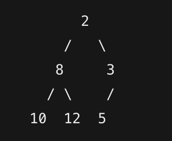
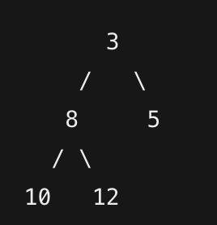

# 5. Binary Heap


## Binary Heap이란?

- Binary Heap이란 완전 이진 트리(Complete Binary Tree)의 형태를 띈다.
- 부모 노드가 자식 노드보다 작거나(최소 힙, Min Heap) 크다는(최대 힙, Max Heap) 특성을 갖는 자료구조이다.
- 우선순위 큐(Priority Queue) 구현 등 다양한 알고리즘에서 효율적으로 활용
  
---

## 주요 키워드

- **완전 이진 트리 (Complete Binary Tree):** 모든 레벨에서 노드가 꽉 차 있으며, 마지막 레벨은 왼쪽부터 채워진 트리.
- **최소 힙 (Min Heap):** 부모 노드가 자식 노드보다 값이 작거나 같은 힙. 최솟값이 루트에 위치.
- **최대 힙 (Max Heap):** 부모 노드가 자식 노드보다 값이 크거나 같은 힙. 최댓값이 루트에 위치.
- **우선순위 큐 (Priority Queue):** 각 요소에 우선순위를 부여하여 높은 우선순위 요소를 빠르게 추출하는 자료구조.

---

## Binary Heap의 구조와 동작 원리
1. 배열 기반 구현
   배열의 인덱스 계산을 통해 부모와 자식 간의 관계를 쉽게 표현할 수 있다.  
   예를 들어, 0번 인덱스를 루트로 사용하는 경우:

- 부모 노드의 인덱스: `(i - 1) / 2`
- 왼쪽 자식의 인덱스: `2 * i + 1`
- 오른쪽 자식의 인덱스: `2 * i + 2`

이러한 계산 방법은 자료구조의 삽입, 삭제 연산 시 효율성을 극대화한다. 삽입 시에는 마지막 위치에 요소를 추가한 후 부모와 비교하면서 올바른 위치로 올리는 "heapify-up" 과정을 거치며, 삭제(주로 루트 삭제) 시에는 마지막 요소를 루트에 대입하고 "heapify-down"을 통해 올바른 위치로 내리는 과정이 필요하다.

---
## 실제 작동 로직
### 1. 삽입 (Insertion)
Binary Heap에 새로운 데이터를 삽입하는 과정은 **heapify-up** 과정을 거쳐 부모와 비교하며 올바른 위치로 이동하는 방식으로 진행된다.

현재 최소 힙 상태:

이를 배열로 표현하면: `[3, 8, 5, 10, 12]`

**새로운 값: 2**를 삽입하는 경우

1. **배열의 맨 끝에 값 추가:**
    - 배열은 `[3, 8, 5, 10, 12, 2]`가 된다.
    - 트리 구조에서는 2가 가장 오른쪽 끝(마지막 레벨의 오른쪽 자식)으로 추가된다.
2. **heapify-up 시작:**
    - 새로 추가된 노드(2)의 부모 노드 인덱스는 `(5 - 1)/2 = 2` (정수 나눗셈)이며, 이 경우 부모 노드는 `5`이다.
    - **비교:** 2와 5를 비교 → 2 < 5 이므로 두 노드의 위치를 교환한다.
      
3.  **다시 heapify-up:**
    - 이제 2의 인덱스는 2이다. 이 노드의 부모 인덱스는 `(2-1)/2 = 0`이며, 부모 노드는 `3`이다.
    - **비교:** 2와 3을 비교 → 2 < 3 이므로 교환한다.

4. **최종 트리 상태:**
    - 배열: `[2, 8, 3, 10, 12, 5]`
    
### 제거 (Removal)

최소 힙에서 주로 **제거** 작업은 **최소값(루트 노드)**를 삭제하는 것으로 진행되며, **heapify-down** 과정을 통해 힙의 속성을 복원한다.

배열: `[2, 8, 3, 10, 12, 5]`
![[Pasted image 20250327175336.png]]

1. **루트 노드 삭제:**
    - 루트에 위치한 최소값인 `2`를 삭제한다.
    - 보통 배열의 마지막 요소(`5`)를 루트 자리에 올려 놓는다.
    - 배열은 임시적으로 `[5, 8, 3, 10, 12]`가 된다.

2. **heapify-down 시작:**
    - 새 루트(5)의 자식 노드 인덱스는 왼쪽 `2*0+1 = 1` (값 8)와 오른쪽 `2*0+2 = 2` (값 3)이다.
    - **비교:** 5와 두 자식(8, 3)을 비교 → 두 자식 중 더 작은 값은 `3`.
    - **교환:** 5와 3의 위치를 교환.

3. **트리 상태 업데이트:**
    - 배열: `[3, 8, 5, 10, 12]`
    
4. **heapify-down 재실행:**
- 교환된 5의 인덱스는 2이다.
- 해당 노드의 왼쪽 자식 인덱스는 `2*2+1 = 5`, 오른쪽 자식 인덱스는 `2*2+2 = 6`인데, 이 인덱스들은 배열 범위를 벗어나므로 heapify-down 종료된다.

## 구현 코드

```java

public class MinHeap {
    private int[] heap;
    private int size;
    private int capacity;

    // 생성자: 초기 용량(capacity)을 설정
    public MinHeap(int capacity) {
        this.capacity = capacity;
        heap = new int[capacity];
        size = 0;
    }

    // 부모, 왼쪽, 오른쪽 인덱스 계산 메서드
    private int getParent(int index) {
        return (index - 1) / 2;
    }
    
    private int getLeftChild(int index) {
        return 2 * index + 1;
    }
    
    private int getRightChild(int index) {
        return 2 * index + 2;
    }

    // 현재 힙이 꽉 찼는지 확인하는 메서드
    private boolean isFull() {
        return size == capacity;
    }

    // 스왑(swap) 메서드: 두 인덱스의 값을 교환
    private void swap(int indexOne, int indexTwo) {
        int temp = heap[indexOne];
        heap[indexOne] = heap[indexTwo];
        heap[indexTwo] = temp;
    }

    // 삽입 메서드: 새 요소를 힙에 추가한 후 heapify-up 수행
    public void insert(int element) {
        if (isFull()) {
            throw new IllegalStateException("Heap is full");
        }
        heap[size] = element;
        int current = size;
        size++;

        // 부모와 비교하여 올바른 위치를 찾는다.
        while (current > 0 && heap[current] < heap[getParent(current)]) {
            swap(current, getParent(current));
            current = getParent(current);
        }
    }

    // 최소값(루트)을 삭제하고 반환하는 메서드
    public int extractMin() {
        if (size == 0) {
            throw new IllegalStateException("Heap is empty");
        }
        int min = heap[0];
        heap[0] = heap[size - 1];
        size--;
        heapifyDown(0);
        return min;
    }

    // heapify-down: 루트에서부터 올바른 위치로 내리는 과정
    private void heapifyDown(int index) {
        int smallest = index;
        int left = getLeftChild(index);
        int right = getRightChild(index);

        if (left < size && heap[left] < heap[smallest]) {
            smallest = left;
        }
        if (right < size && heap[right] < heap[smallest]) {
            smallest = right;
        }
        if (smallest != index) {
            swap(index, smallest);
            heapifyDown(smallest);
        }
    }

    // 현재 힙 상태를 배열 형태로 출력하는 메서드
    public void printHeap() {
        for (int i = 0; i < size; i++) {
            System.out.print(heap[i] + " ");
        }
        System.out.println();
    }
}

```
